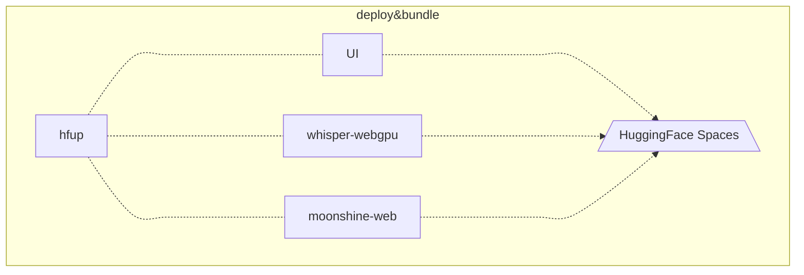

<h1 align="center">Web AI Examples</h1>

> [!NOTE]
>
> This project is part of (and also associate to) the [Project AIRI](https://github.com/moeru-ai/airi), we aim to build a LLM-driven VTuber like [Neuro-sama](https://www.youtube.com/@Neurosama) (subscribe if you didn't!) if you are interested in, please do give it a try on [live demo](https://airi.moeru.ai).
>
> We experiment HuggingFace models and Transformers.js APIs here in WebAI examples repository, where it helped to grow our technologies inside of the [Project AIRI](https://github.com/moeru-ai/airi) primary repository. Things like:
>
> - Real-time voice chat
> - Real-time visual understanding
> - Voice processing
> - Video frames processing
>
> were all born from here.

## Development

```shell
pnpm i
```

```shell
pnpm dev
```

## Other examples about AI / Model inference from Project AIRI

- [WebAI Example Realtime Voice Chat](https://github.com/proj-airi/webai-example-realtime-voice-chat): 🎤💬 Full example of implementing ChatGPT's realtime voice from scratch with VAD + STT + LLM + TTS technology stack within almost one file!
- [🤗 candle Examples](https://github.com/proj-airi/candle-examples): Examples of using [🤗 candle](https://github.com/huggingface/candle) for inference AI models in Rust, you could think of it as an alternative and more transformers like library than [Burn Examples (this repository)].
- [Burn Examples](https://github.com/proj-airi/burn-examples): Examples of using [Burn.dev](https://burn.dev) for inference AI models in Rust, you could think of it as an alternative and more advanced library than [🤗 candle Examples].

## Other side projects born from Project Airi

- [Awesome AI VTuber](https://github.com/proj-airi/awesome-ai-vtuber): A curated list of AI VTubers and related projects
- [`unspeech`](https://github.com/moeru-ai/unspeech): Universal endpoint proxy server for `/audio/transcriptions` and `/audio/speech`, like LiteLLM but for any ASR and TTS
- [`hfup`](https://github.com/moeru-ai/hfup): tools to help on deploying, bundling to HuggingFace Spaces
- [`xsai-transformers`](https://github.com/moeru-ai/xsai-transformers): Experimental [🤗 Transformers.js](https://github.com/huggingface/transformers.js) provider for [xsAI](https://github.com/moeru-ai/xsai).
- [WebAI: Realtime Voice Chat](https://github.com/proj-airi/webai-realtime-voice-chat): Full example of implementing ChatGPT's realtime voice from scratch with VAD + STT + LLM + TTS.
- [`@proj-airi/drizzle-duckdb-wasm`](https://github.com/moeru-ai/airi/tree/main/packages/drizzle-duckdb-wasm/README.md): Drizzle ORM driver for DuckDB WASM
- [`@proj-airi/duckdb-wasm`](https://github.com/moeru-ai/airi/tree/main/packages/duckdb-wasm/README.md): Easy to use wrapper for `@duckdb/duckdb-wasm`
- [Airi Factorio](https://github.com/moeru-ai/airi-factorio): Allow Airi to play Factorio
- [Factorio RCON API](https://github.com/nekomeowww/factorio-rcon-api): RESTful API wrapper for Factorio headless server console
- [`autorio`](https://github.com/moeru-ai/airi-factorio/tree/main/packages/autorio): Factorio automation library
- [`tstl-plugin-reload-factorio-mod`](https://github.com/moeru-ai/airi-factorio/tree/main/packages/tstl-plugin-reload-factorio-mod): Reload Factorio mod when developing
- [Velin](https://github.com/luoling8192/velin): Use Vue SFC and Markdown to write easy to manage stateful prompts for LLM
- [`demodel`](https://github.com/moeru-ai/demodel): Easily boost the speed of pulling your models and datasets from various of inference runtimes.
- [`inventory`](https://github.com/moeru-ai/inventory): Centralized model catalog and default provider configurations backend service
- [MCP Launcher](https://github.com/moeru-ai/mcp-launcher): Easy to use MCP builder & launcher for all possible MCP servers, just like Ollama for models!
- [🥺 SAD](https://github.com/moeru-ai/sad): Documentation and notes for self-host and browser running LLMs.


