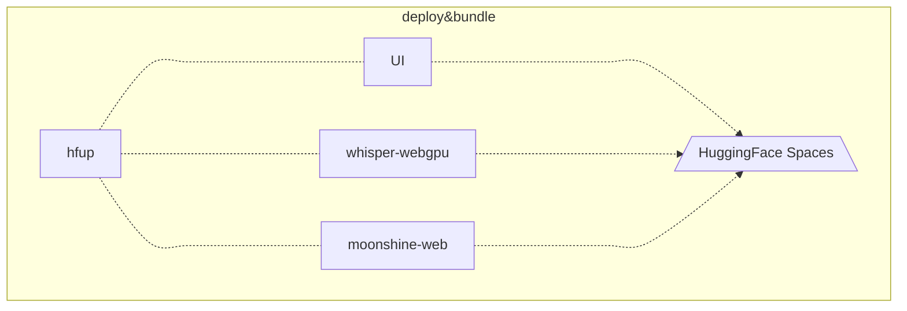

<h1 align="center">アイリ企画 Project AIRI Web AI Examples</h1>

## Development

```shell
pnpm i
```

```shell
pnpm dev
```

## Other side projects born from Project Airi

- [`unspeech`](https://github.com/moeru-ai/unspeech): Universal endpoint proxy server for `/audio/transcriptions` and `/audio/speech`, like LiteLLM but for any ASR and TTS
- [`hfup`](https://github.com/moeru-ai/airi/tree/main/packages/hfup): tools to help on deploying, bundling to HuggingFace Spaces
- [`@proj-airi/drizzle-duckdb-wasm`](https://github.com/moeru-ai/airi/tree/main/packages/drizzle-duckdb-wasm/README.md): Drizzle ORM driver for DuckDB WASM
- [`@proj-airi/duckdb-wasm`](https://github.com/moeru-ai/airi/tree/main/packages/duckdb-wasm/README.md): Easy to use wrapper for `@duckdb/duckdb-wasm`
- [`@proj-airi/lobe-icons`](https://github.com/moeru-ai/airi/tree/main/packages/lobe-icons): Iconify JSON bundle for amazing AI & LLM icons from [lobe-icons](https://github.com/lobehub/lobe-icons), support Tailwind and UnoCSS
- [`@proj-airi/elevenlabs`](https://github.com/moeru-ai/airi/tree/main/packages/elevenlabs): TypeScript definitions for ElevenLabs API
- [Airi Factorio](https://github.com/moeru-ai/airi-factorio): Allow Airi to play Factorio
- [Factorio RCON API](https://github.com/nekomeowww/factorio-rcon-api): RESTful API wrapper for Factorio headless server console
- [`autorio`](https://github.com/moeru-ai/airi-factorio/tree/main/packages/autorio): Factorio automation library
- [`tstl-plugin-reload-factorio-mod](https://github.com/moeru-ai/airi-factorio/tree/main/packages/tstl-plugin-reload-factorio-mod): Reload Factorio mod when developing
- [🥺 SAD](https://github.com/moeru-ai/sad): Documentation and notes for self-host and browser running LLMs


